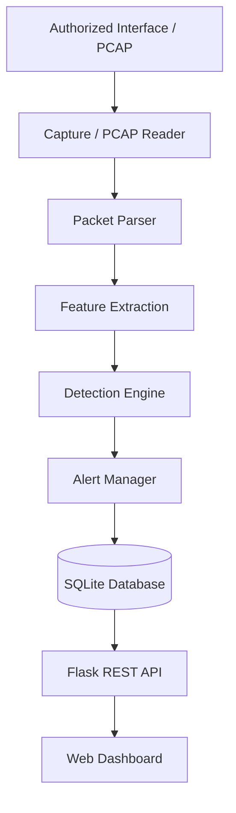
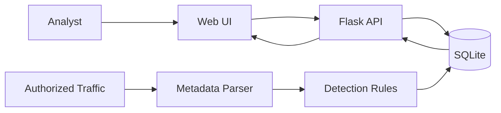
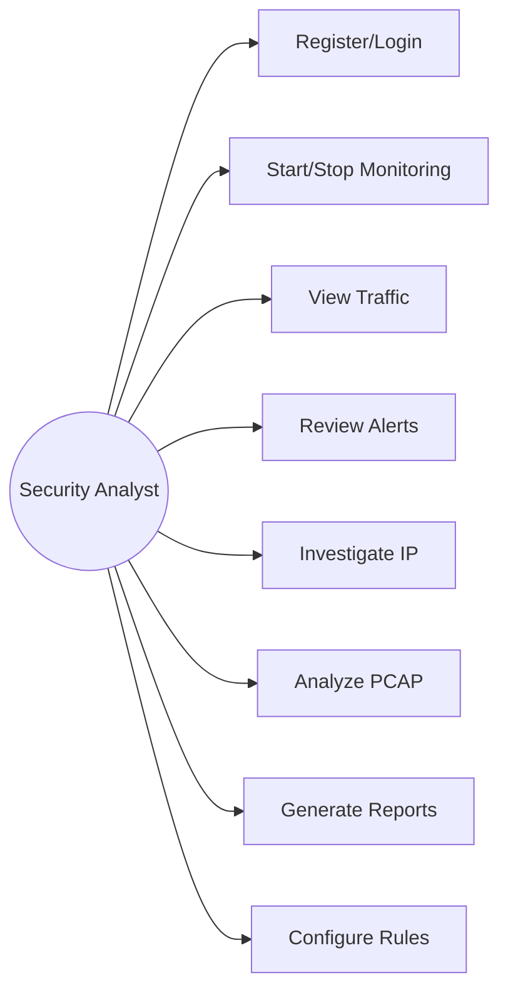
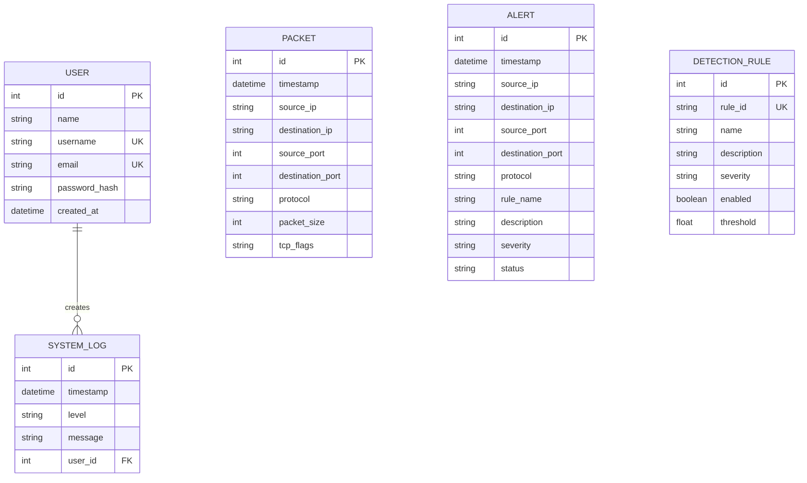

# BCA Project Documentation — CyberShield

## 1. Title
CyberShield – Real-Time Network Intrusion Detection System

## 2. Abstract
CyberShield is a defensive network monitoring and intrusion detection application designed for an academic environment. The system observes authorized network packet metadata or reads authorized PCAP files, extracts features such as IP addresses, ports, protocols, packet sizes, and TCP flags, and evaluates them against configurable security rules. Detected events are stored as alerts in SQLite and displayed through a Flask web dashboard. A synthetic Demo Mode provides safe demonstrations without generating malicious traffic.

## 3. Introduction
Modern networks generate large volumes of traffic. Manual inspection is difficult, so intrusion detection systems help identify unusual or suspicious behavior. CyberShield demonstrates the basic architecture of a network IDS using Python and Flask.

## 4. Problem Statement
A small lab or academic environment needs an understandable tool for observing authorized network metadata and identifying common suspicious patterns without using offensive attack tools.

## 5. Existing System
Traditional enterprise IDS products can be complex and expensive for a student project. They may also require infrastructure beyond a small lab.

## 6. Proposed System
CyberShield combines packet metadata extraction, rule-based detection, statistical anomaly checking, alert storage, reporting, and a web dashboard in one local application.

## 7. Objectives
- Monitor authorized network metadata.
- Analyze authorized PCAP files.
- Detect suspicious patterns.
- Generate and manage alerts.
- Provide a clear dashboard.
- Maintain secure user authentication.
- Demonstrate defensive cybersecurity safely.

## 8. Scope
The system is intended for localhost, private labs, owned devices, authorized networks, and authorized PCAP files. It does not capture credentials or inspect/store application payloads.

## 9. Hardware Requirements
- Dual-core CPU or better
- 4 GB RAM minimum; 8 GB recommended
- 1 GB free storage
- Network adapter for live authorized capture

## 10. Software Requirements
- Python 3.11+
- Flask
- Flask-SQLAlchemy
- Flask-Login
- Flask-WTF
- Scapy
- SQLite
- Bootstrap 5
- Chart.js
- ReportLab
- Pytest
- Windows or Linux

## 11. Functional Requirements
1. Registration and login.
2. Secure session management.
3. Dashboard statistics.
4. Start/stop monitoring.
5. PCAP upload and analysis.
6. Rule-based detection.
7. Alert management.
8. IP investigation.
9. Report export.
10. Demo Mode.

## 12. Non-Functional Requirements
Security, usability, maintainability, reliability, responsiveness, and portability.

## 13. System Architecture

## 14. Data Flow Diagram

## 15. Use Case Diagram

## 16. ER Diagram

## 17. Database Design
User stores identity information and password hashes. Packet stores metadata only. Alert stores detected events. DetectionRule stores configurable thresholds. SystemLog stores security/application events.

## 18. Module Description
- Authentication: registration, login, logout.
- Capture: background Scapy capture.
- Parser: converts packets into safe metadata.
- Detection: evaluates configurable rules and statistics.
- Alerts: lifecycle management.
- API: JSON endpoints for dashboard and controls.
- Reports: CSV and PDF generation.
- UI: responsive SOC-style interface.
- Demo: synthetic traffic metadata.

## 19. Detection Methodology
CS-001 counts unique destination ports in a 60-second source-IP window. CS-002 counts observed events in the same window. CS-003 counts ICMP events. CS-004 counts DNS events or destination port 53. CS-005 compares SYN observations with observed SYN-ACK patterns. Thresholds are stored in the database.

## 20. Implementation
Python provides backend logic, Scapy handles packet metadata, Flask provides web/API functionality, SQLAlchemy handles persistence, and JavaScript/Chart.js provides live dashboard updates.

## 21. Testing
Automated tests cover registration, hashing, login, authentication, demo alert generation, rule detection, and protected APIs. Manual tests should also verify PCAP uploads, invalid extensions, capture permissions, and report downloads.

## 22. Results
Expected results include successful user authentication, dashboard loading, synthetic traffic generation, detection alerts, status updates, traffic visualization, and report export.

## 23. Advantages
- Beginner-friendly architecture
- Local/offline operation
- No paid APIs
- Safe Demo Mode
- Modular code
- Configurable rules
- Metadata minimization

## 24. Limitations
- Not a replacement for an enterprise IDS.
- Heuristic thresholds can cause false positives/negatives.
- Live capture requires supported drivers/permissions.
- SQLite is not intended for very high traffic volume.
- No automatic blocking is implemented.

## 25. Future Enhancements
Machine learning, threat intelligence, SIEM integration, RBAC, PostgreSQL, Docker, cloud deployment, topology visualization, and carefully governed incident response.

## 26. Conclusion
CyberShield demonstrates how a defensive IDS can combine packet metadata processing, rule-based detection, alert management, secure authentication, persistence, reporting, and visualization in a practical BCA project.

## 27. References
- Python documentation
- Flask documentation
- Flask-SQLAlchemy documentation
- Flask-Login documentation
- Scapy documentation
- SQLite documentation
- Bootstrap documentation
- Chart.js documentation
- OWASP Web Security guidance
